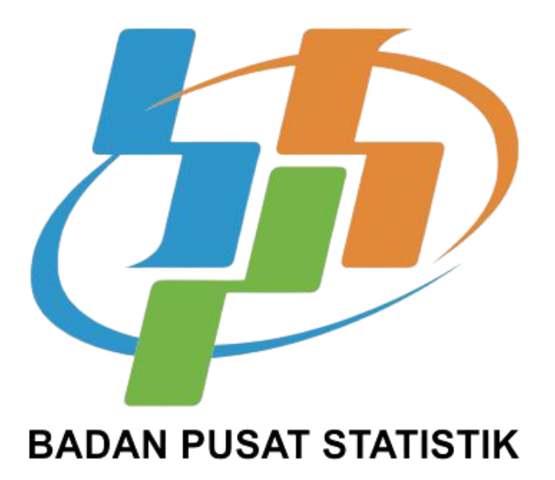

# Klastering-Penggunaan-Kendaraan-Bermotor-di-Jawa-Barat-Menggunakan-Metode-K-Means

  
   

Proyek ini berisi analisis klastering mengenai pola penggunaan kendaraan bermotor di Provinsi Jawa Barat dengan menggunakan metode K-Means. Analisis dilakukan untuk mengelompokkan kabupaten/kota berdasarkan jenis dan jumlah kendaraan bermotor, sehingga dapat menggambarkan karakteristik wilayah dengan tingkat kepadatan kendaraan yang berbeda.

## 💡Latar Belakang (Yasinta)

## 🎯Tujuan Penelitian (Yasinta)

## 📊Data dan Variabel (Avin)

  
   
  <i>Badan Pusat Statistik (BPS)</i>

## ⚙️Metodologi (Joi)
Proyek ini menggunakan dua pendekatan utama:
1. Statistik Deskriptif : memberikan gambaran umum mengenai sebaran dan karakteristik data kendaraan bermotor.
2. Klastering K-Means : mengelompokkan daerah berdasarkan kesamaan karakteristik penggunaan kendaraan bermotor.

## Manfaat Penelitian (Yasinta)

## 👥Tim Penyusun
* Joice Junansi Tandirerung (M0501251007)
* Avin Rahmadian (M0501251023)
* Charisma Yasintasya Kafilla (M0501251039)
* Fransisca Juventini Mandas (M0501251045)
* Baiq Wita Rachmatia (M0501251061)
