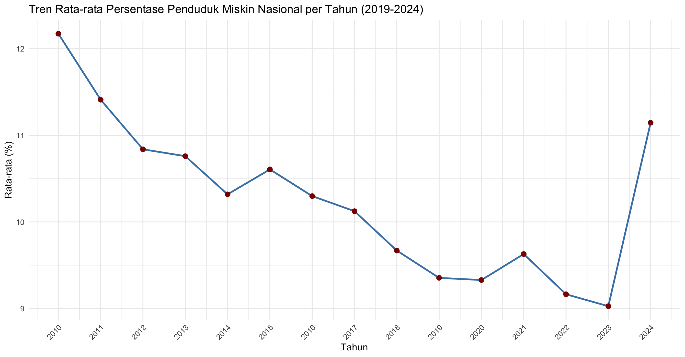

  
   

# 📖 **Pendahuluan**

Proyek ini menganalisis pengelompokan wilayah di Jawa Barat berdasarkan karakteristik kemiskinan dengan membandingkan metode K-Means dan K-Medoids. Perbandingan ini dilakukan untuk melihat perbedaan hasil cluster dari kedua metode dan menentukan pendekatan yang lebih sesuai dalam menggambarkan pola kemiripan kondisi kemiskinan antarwilayah.

# 💡 **Latar Belakang (Yasinta)**

Kemiskinan merupakan salah satu isu pembangunan sosio-ekonomi yang paling mendesak dan kompleks di Indonesia. Meskipun telah terjadi peningkatan pertumbuhan ekonomi secara umum, tantangan dalam mengurangi disparitas pendapatan dan menjangkau kelompok rentan tetap signifikan. Data tingkat kemiskinan menjadi indikator krusial dalam mengukur keberhasilan pembangunan dan efektivitas kebijakan pemerintah. Oleh karena itu, analisis mendalam terhadap tren dan distribusi kemiskinan dari tahun ke tahun khususnya pada periode 2019 hingga 2024 sangat diperlukan untuk memahami dinamika perubahan sosial ekonomi pasca-pandemi dan adaptasi kebijakan yang diterapkan.

Analisis tingkat kemiskinan seringkali disajikan dalam bentuk statistik agregat nasional atau perbandingan langsung antar provinsi. Namun, pendekatan ini cenderung menyembunyikan heterogenitas kondisi di lapangan. Indonesia, sebagai negara kepulauan yang luas, memiliki keragaman yang ekstrem dalam faktor-faktor yang memengaruhi kemiskinan, mulai dari akses infrastruktur, kondisi geografis, hingga struktur ekonomi lokal. Untuk merumuskan kebijakan yang tepat sasaran, penting untuk mengidentifikasi pola-pola kemiskinan yang serupa di antara berbagai provinsi. Pengelompokan ini akan mengungkapkan perbedaan kondisi sosial ekonomi yang mendasar antar wilayah, memungkinkan alokasi sumber daya yang lebih efisien dan intervensi yang disesuaikan dengan kebutuhan spesifik kelompok provinsi.

Dalam konteks analisis data yang kompleks dan multidimensi, metode Clustering K-Means menawarkan solusi yang efektif. K-Means adalah algoritma pembelajaran tanpa pengawasan (unsupervised learning) yang bertujuan untuk mengelompokkan n objek pengamatan ke dalam k cluster (kelompok) berdasarkan kedekatan jarak antara objek. Dalam proyek ini, K-Means akan diterapkan untuk:Mengelompokkan provinsi berdasarkan data tingkat kemiskinan periode 2019-2024.Menggambarkan pola tingkat kemiskinan yang tersembunyi (misalnya, kelompok provinsi dengan kemiskinan yang stagnan, menurun pesat, atau fluktuatif).Penerapan metode K-Means ini tidak hanya memberikan gambaran statistik, tetapi juga menghasilkan visualisasi dan interpretasi yang jelas mengenai peta kemiskinan di Indonesia.

# 🎯 **Tujuan Penelitian (Yasinta)**

Berdasarkan latar belakang di atas, penelitian ini memiliki tujuan utama untuk melakukan analisis klasterisasi angka kemiskinan di Indonesia periode 2019–2024 menggunakan Metode K-Means. Hasil klasterisasi ini diharapkan dapat memberikan kontribusi praktis berupa peta klaster kemiskinan yang jelas, yang dapat digunakan oleh Kementerian/Lembaga terkait dan pemerintah daerah sebagai dasar perumusan strategi penanggulangan kemiskinan yang lebih fokus, terukur, dan berbasis pada kondisi sosial ekonomi regional yang sebenarnya.

# 📊 **Data dan Variabel (Avin)**

   
  Open Data Jabar

   

   
  BPS Jawa Barat

   

### Variabel
| Kode | Nama Variabel                                                                 |
|------|-------------------------------------------------------------------------------|
| X1   | Persentase Penduduk Miskin Usia 15+ Tidak Bekerja                             |
| X2   | Persentase Penduduk Miskin Usia 15+ Pekerja Informal                          |
| X3   | Persentase Penduduk Miskin Usia 15+ Pekerja Formal                            |
| X4   | Persentase Pengeluaran per Kapita Rumah Tangga Miskin untuk Makanan           |
| X5   | Persentase Pengeluaran per Kapita Rumah Tangga Miskin untuk Bukan Makanan     |
| X6   | Persentase Rumah Tangga Miskin yang menggunakan Air Layak                     |
| X7   | Persentase Rumah Tangga Miskin yang menggunakan Jamban Sendiri/Bersama        |
| X8   | Indeks Kedalaman Kemiskinan                                                   |
| X9   | Indeks Keparahan Kemiskinan                                                   |

###  Cuplikan Data
| Kabupaten/Kota   |   X1  |   X2  |   X3  |   X4  |   X5  |   X6  |   X7  |  X8  |  X9  |
|------------------|-------|-------|-------|-------|-------|-------|-------|------|------|
| Bogor            | 42.12 | 24.35 | 33.53 | 62.81 | 37.19 | 79.77 | 92.83 | 1.08 | 0.26 |
| Sukabumi         | 40.40 | 37.22 | 22.38 | 67.45 | 32.55 | 94.16 | 89.38 | 0.88 | 0.20 |
| Cianjur          | 37.36 | 42.34 | 20.30 | 66.02 | 33.98 | 92.71 | 93.89 | 1.58 | 0.41 |
| Bandung          | 38.87 | 26.07 | 35.06 | 64.58 | 35.42 | 91.80 | 94.30 | 0.61 | 0.09 |
| Garut            | 38.26 | 39.13 | 22.60 | 68.37 | 31.63 | 78.97 | 78.24 | 1.41 | 0.29 |
| ...              |  ...  |  ...  |  ...  |  ...  |  ...  |  ...  |  ...  | ...  | ...  |
| Kota Cirebon     | 44.40 | 22.30 | 33.30 | 60.74 | 39.26 | 89.26 | 100   | 1.18 | 0.25 |
| Kota Bekasi      | 41.56 | 17.83 | 40.61 | 54.15 | 45.85 | 100   | 98.09 | 0.80 | 0.21 |
| Kota Depok       | 40.43 | 18.31 | 41.26 | 56.42 | 43.58 | 100   | 100   | 0.34 | 0.07 |
| Kota Cimahi      | 39.74 | 21.43 | 38.83 | 60.10 | 39.90 | 100   | 100   | 0.83 | 0.21 |
| Kota Banjar      | 40.80 | 32.07 | 27.13 | 69.81 | 30.19 | 95.34 | 87.53 | 1.03 | 0.29 |

<table><tr>

<td style="vertical-align: top; width: 50%;">

<h3>Variabel</h3>

<table>
<tr><th>Kode</th><th>Nama Variabel</th></tr>
<tr><td>X1</td><td>Persentase Penduduk Miskin Usia 15+ Tidak Bekerja</td></tr>
<tr><td>X2</td><td>Persentase Penduduk Miskin Usia 15+ Pekerja Informal</td></tr>
<tr><td>X3</td><td>Persentase Penduduk Miskin Usia 15+ Pekerja Formal</td></tr>
<tr><td>X4</td><td>Persentase Pengeluaran RT Miskin untuk Makanan</td></tr>
<tr><td>X5</td><td>Pengeluaran RT Miskin untuk Bukan Makanan</td></tr>
<tr><td>X6</td><td>RT Miskin menggunakan Air Layak</td></tr>
<tr><td>X7</td><td>RT Miskin menggunakan Jamban</td></tr>
<tr><td>X8</td><td>Indeks Kedalaman Kemiskinan</td></tr>
<tr><td>X9</td><td>Indeks Keparahan Kemiskinan</td></tr>
</table>

</td>

<td style="vertical-align: top; width: 50%;">

<h3>Cuplikan Data</h3>

<table>
  <tr>
    <th>Kab/Kota</th><th>X1</th><th>X2</th><th>X3</th><th>X4</th><th>X5</th><th>X6</th><th>X7</th><th>X8</th><th>X9</th>
  </tr>

  <!-- 4 Baris Teratas -->
  <tr><td>Bogor</td><td>42.12</td><td>24.35</td><td>33.53</td><td>62.81</td><td>37.19</td><td>79.77</td><td>92.83</td><td>1.08</td><td>0.26</td></tr>
  <tr><td>Sukabumi</td><td>40.40</td><td>37.22</td><td>22.38</td><td>67.45</td><td>32.55</td><td>94.16</td><td>89.38</td><td>0.88</td><td>0.20</td></tr>
  <tr><td>Cianjur</td><td>37.36</td><td>42.34</td><td>20.30</td><td>66.02</td><td>33.98</td><td>92.71</td><td>93.89</td><td>1.58</td><td>0.41</td></tr>
  <tr><td>Bandung</td><td>38.87</td><td>26.07</td><td>35.06</td><td>64.58</td><td>35.42</td><td>91.80</td><td>94.30</td><td>0.61</td><td>0.09</td></tr>
  <!-- TITIK-TITIK DI TENGAH -->
  <tr><td colspan="10" style="text-align:center;">...</td></tr>
  <!-- 4 Baris Terbawah -->
  <tr><td>Kota Bekasi</td><td>41.56</td><td>17.83</td><td>40.61</td><td>54.15</td><td>45.85</td><td>100</td><td>98.09</td><td>0.80</td><td>0.21</td></tr>
  <tr><td>Kota Depok</td><td>40.43</td><td>18.31</td><td>41.26</td><td>56.42</td><td>43.58</td><td>100</td><td>100</td><td>0.34</td><td>0.07</td></tr>
  <tr><td>Kota Cimahi</td><td>39.74</td><td>21.43</td><td>38.83</td><td>60.10</td><td>39.90</td><td>100</td><td>100</td><td>0.83</td><td>0.21</td></tr>
  <tr><td>Kota Banjar</td><td>40.80</td><td>32.07</td><td>27.13</td><td>69.81</td><td>30.19</td><td>95.34</td><td>87.53</td><td>1.03</td><td>0.29</td></tr>
</table>

</td>
</tr></table>

# ⚙️ **Metodologi (Joi)**

Proyek ini menggunakan dua pendekatan utama:
1. Statistik Deskriptif : menggambarkan sebaran dan tren tingkat kemiskinan provinsi di Indonesia pada periode 2019–2024.

| Variabel | n  | Mean  | Std Dev | Min   | Q1    | Median | Q3    | Max    |
| -------- | -- | ----- | ------- | ----- | ----- | ------ | ----- | ------ |
| **X1**   | 27 | 8.01  | 2.65    | 2.34  | 6.36  | 8.41   | 10.19 | 11.93  |
| **X2**   | 27 | 39.58 | 3.87    | 25.10 | 38.01 | 40.40  | 41.74 | 44.58  |
| **X3**   | 27 | 31.12 | 8.86    | 17.24 | 24.18 | 31.24  | 38.18 | 50.83  |
| **X4**   | 27 | 29.30 | 6.44    | 20.30 | 23.86 | 27.48  | 34.45 | 41.26  |
| **X5**   | 27 | 64.02 | 4.01    | 54.15 | 61.60 | 64.75  | 66.06 | 71.27  |
| **X6**   | 27 | 35.98 | 4.01    | 28.73 | 33.95 | 35.25  | 38.41 | 45.85  |
| **X7**   | 27 | 92.15 | 7.98    | 74.47 | 88.80 | 94.16  | 98.71 | 100.00 |
| **X8**   | 27 | 93.82 | 5.75    | 78.24 | 91.21 | 95.19  | 97.86 | 100.00 |

2. Metode K-Means :
   Metode K-Means Clustering merupakan salah satu teknik unsupervised machine learning yang digunakan untuk mengelompokkan data ke dalam beberapa kelompok (cluster) berdasarkan kemiripan karakteristik. Algoritma ini bekerja dengan meminimalkan jarak antar data dalam satu cluster dan memaksimalkan perbedaan antar cluster
   Tahapan metode K-Menas :
   a. Persiapan dan Pembersihan Data
   b. Menentukan Jumlah Cluster (K)
   c. Proses Algoritma K-Means

### A. Statistik Deskriptif
Statistik deskriptif digunakan untuk memberikan gambaran umum mengenai sebaran nilai indikator kemiskinan pada 27 kabupaten/kota di Provinsi Jawa Barat. Berdasarkan tabel di bawah, terlihat bahwa setiap variabel memiliki nilai rata-rata dan variasi yang berbeda, sehingga menunjukkan adanya perbedaan kondisi antar wilayah dan pentingnya dilakukan analisis lanjutan seperti clustering.

| Variabel|  N |  Mean | Std Dev |  Min  |   Q1   | Median |   Q3   |  Max  |
|---------|----|-------|---------|-------|--------|--------|--------|-------|
| **X1**  | 27 | 39.58 |   3.87  | 25.10 | 38.01  | 40.40  | 41.74  | 44.58 |
| **X2**  | 27 | 31.12 |   8.86  | 17.24 | 24.18  | 31.24  | 38.17  | 50.83 |
| **X3**  | 27 | 29.30 |   6.44  | 20.30 | 23.86  | 27.48  | 34.44  | 41.26 |
| **X4**  | 27 | 64.02 |   4.01  | 54.15 | 61.60  | 64.75  | 66.06  | 71.27 |
| **X5**  | 27 | 35.98 |   4.01  | 28.73 | 33.94  | 35.25  | 38.40  | 45.85 |
| **X6**  | 27 | 92.15 |   7.98  | 74.47 | 88.80  | 94.16  | 98.70  | 100.0 |
| **X7**  | 27 | 93.82 |   5.75  | 78.24 | 91.20  | 95.19  | 97.86  | 100.0 |
| **X8**  | 27 |  1.18 |   0.43  |  0.34 |  0.88  |  1.17  |  1.50  |  2.05 |
| **X9**  | 27 |  0.28 |   0.13  |  0.07 |  0.20  |  0.26  |  0.36  |  0.54 |

### B. Metode K-Means
#### 1. Menstandarisasi Data 
#### 2. Menghitung Jarak Antar Observasi
#### 3. Menentukan Cluster Optimal dengan Shiloute
#### 4. Pembentukan Cluster dan Visualisasi Cluster 

# 🎨 **Visualisasi**
### 1. Peta Klasterisasi Tingkat Kemiskinan Provinsi di Indonesia (Avin)

   
  Gambar 1. Peta Klasterisasi Pra & Pandemi Covid-19

   

### Tabel Hasil Klasterisasi Provinsi Pra & Pandemi Covid-19

| Cluster | Kriteria | Nama Provinsi |
|:-------:|:-------:|:----------------------------------------------------------------------------------------------------------------------------------------------------------------------------------------------------------------------------------|
| **1** | **Tinggi** | Nusa Tenggara Timur, Papua Barat, Papua |
| **2** | **Menengah** | Sumatera Utara, Sumatera Barat, Riau, Jambi, Bangka Belitung, Kepulauan Riau, Jakarta Raya, Jawa Barat, Banten, Bali, Kalimantan Barat, Kalimantan Tengah, Kalimantan Selatan, Kalimantan Timur, Kalimantan Utara, Sulawesi Utara, Sulawesi Selatan |
| **3** | **Rendah** | Aceh, Bengkulu, Nusa Tenggara Barat, Gorontalo, Maluku, Sumatera Selatan, Lampung, Jawa Tengah, Yogyakarta, Jawa Timur, Sulawesi Tengah, Sulawesi Tenggara, Sulawesi Barat |

   
  Gambar 2. Peta Klasterisasi Pasca Covid-19

   

### Tabel Hasil Klasterisasi Provinsi Pasca Covid-19

| Cluster | Kriteria | Nama Provinsi |
|:-------:|:-------:|:----------------------------------------------------------------------------------------------------------------------------------------------------------------------------------------------------------------------------------|
| **1** | **Tinggi** | Nusa Tenggara Timur, Papua Barat, Papua |
| **2** | **Menengah** | Sumatera Utara, Sumatera Barat, Riau, Jambi, Bangka Belitung, Kepulauan Riau, Jakarta Raya, Jawa Barat, Banten, Bali, Kalimantan Barat, Kalimantan Tengah, Kalimantan Selatan, Kalimantan Timur, Kalimantan Utara, Sulawesi Utara, Sulawesi Selatan |
| **3** | **Rendah** | Aceh, Bengkulu, Nusa Tenggara Barat, Gorontalo, Maluku, Sumatera Selatan, Lampung, Jawa Tengah, Yogyakarta, Jawa Timur, Sulawesi Tengah, Sulawesi Tenggara, Sulawesi Barat |

   
### 2. Trend Data rata rata pertahun (line chart) (Joy)

   
  Gambar 3. Tren Rata-Rata Presentase Penduduk Miskin Nasional

   

### 3. Provinsi 10 tertinggi dan 10 terendah (Covid) (Bar Chart) (Wita)
### 4. Provinsi 10 tertinggi dan 10 terendah (Pasca Covid) (Bar Chart) (Sisca)
### 5. Distribusi Data Berdasarkan Cluster Gabungan (Density Plot) (sisca)
### 6. Distribusi Data Berdasarkan Cluster Covid (Density Plot) (Joy)
### 7. Distribusi Data Berdasarkan Cluster Pasca Covid (Density Plot) (Wita)

   
  Gambar gatau cobain dlu. Density Plot Pasca Covid

   

# 💎 **Manfaat Penelitian (Yasinta)**

🌟 Manfaat Analisis Klasterisasi Angka Kemiskinan
Proyek ini diharapkan memberikan manfaat yang signifikan bagi berbagai pihak, terutama dalam konteks pengambilan keputusan dan perumusan kebijakan.

1. Manfaat Bagi Pemerintah dan Pembuat Kebijakan (Pusat & Daerah)
Penyusunan Kebijakan yang Tepat Sasaran (Targeted Policy): Hasil klasterisasi (pengelompokan) provinsi akan mengidentifikasi wilayah mana yang memiliki pola kemiskinan serupa. Ini memungkinkan pemerintah merancang intervensi program (seperti bantuan sosial, pelatihan kerja, atau pembangunan infrastruktur) yang spesifik dan disesuaikan dengan kebutuhan setiap klaster, sehingga meningkatkan efektivitas anggaran.

Alokasi Sumber Daya yang Efisien: Dengan memahami klaster mana yang paling parah atau paling rentan, pemerintah dapat memprioritaskan alokasi dana (misalnya, Dana Transfer Daerah atau Dana Desa) ke wilayah yang benar-benar membutuhkan, menghindari pemborosan sumber daya pada wilayah yang pola kemiskinannya sudah membaik.

Pemantauan dan Evaluasi Kinerja: Klaster yang terbentuk dapat digunakan sebagai tolok ukur (benchmarking). Pemerintah dapat membandingkan kinerja penanggulangan kemiskinan antar provinsi dalam klaster yang sama, untuk mengidentifikasi praktik terbaik (best practices) yang dapat direplikasi.

Perencanaan Pembangunan Regional: Data klasterisasi memberikan panduan bagi Badan Perencanaan Pembangunan Nasional/Daerah (Bappenas/Bappeda) dalam menyusun Rencana Pembangunan Jangka Menengah Daerah (RPJMD) yang lebih kontekstual dan berbasis bukti.

2. Manfaat Bagi Dunia Akademis dan Peneliti
Pengembangan Ilmu Pengetahuan: Penelitian ini berkontribusi pada penerapan praktis algoritma Machine Learning (K-Means) di bidang sosial ekonomi dan statistik, khususnya di Indonesia.

Dasar Penelitian Lanjutan: Hasil klasterisasi dapat menjadi dasar untuk penelitian lebih lanjut. Peneliti dapat menggunakan klaster yang terbentuk sebagai variabel eksogen untuk menyelidiki faktor-faktor penentu (misalnya, Indeks Pembangunan Manusia, inflasi, atau tingkat pengangguran) yang mendorong provinsi masuk ke dalam klaster kemiskinan tertentu.

Metodologi Baru: Penelitian ini dapat menjadi referensi metodologis bagi peneliti lain yang ingin melakukan analisis komparatif atau klasterisasi pada data pembangunan regional lainnya.

3. Manfaat Bagi Lembaga Non-Pemerintah (LSM dan Donor)
Fokus Program: Lembaga Swadaya Masyarakat (LSM) dan lembaga donor dapat menggunakan peta klaster ini untuk memfokuskan program bantuan dan pengembangan mereka pada klaster provinsi yang paling membutuhkan dukungan non-pemerintah.

Advokasi yang Lebih Kuat: Data klasterisasi yang dihasilkan memberikan bukti empiris yang kuat untuk mendukung upaya advokasi dalam menuntut kebijakan yang lebih adil dan merata.

# 👥 **Tim Penyusun**

* [Joice Junansi Tandirerung](https://github.com/JoiceJunansi) (M0501251007) 
* [Avin Rahmadian](https://github.com/avinrahmadian) (M0501251023)
* [Charisma Yasintasya Kafilla](https://github.com/yasintasya) (M0501251039)
* [Francisca Juventini Mandas](https://github.com/franciscajuventini09) (M0501251045)
* [Baiq Wita Rachmatia](https://github.com/baiqwitaa) (M0501251061)

