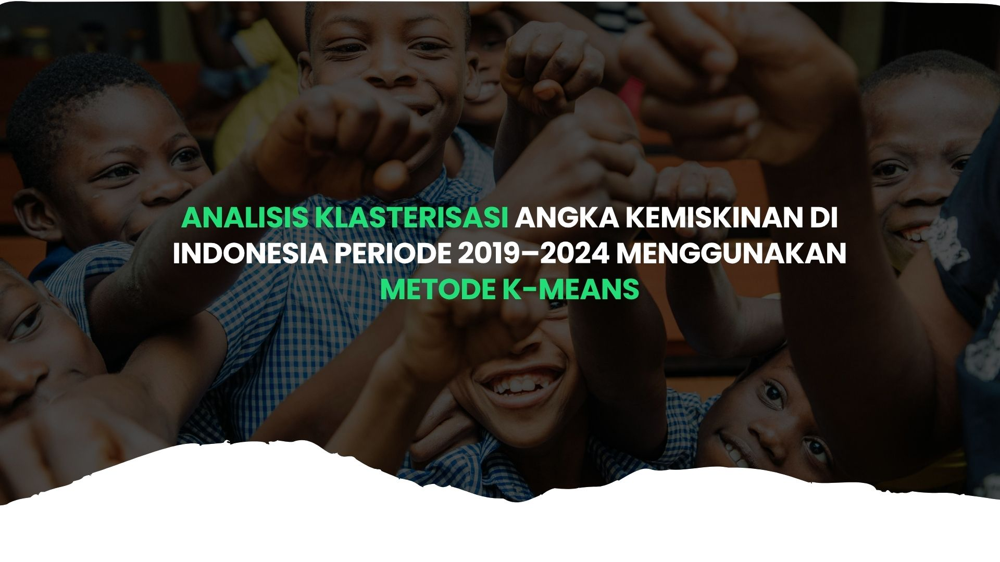
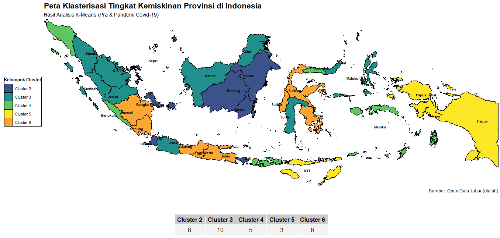

  
   

# 📖 **Pendahuluan**

Proyek ini bertujuan untuk menganalisis tingkat kemiskinan di Indonesia periode 2019 - 2024 menggunakan metode K-Means. Analisis ini dilakukan untuk mengelompokkan provinsi berdasarkan kesamaan tingkat kemiskinan, sehingga dapat menggambarkan pola dan perbedaan kondisi sosial ekonomi antar wilayah.

# 💡 **Latar Belakang (Yasinta)**

# 🎯 **Tujuan Penelitian (Yasinta)**

# 📊 **Data dan Variabel (Avin)**

   
  Open Data Jabar

   

###  Cuplikan Data

| id | kode_provinsi | nama_provinsi         | persentase_penduduk_miskin | tahun |
|----|----------------|-----------------------|-----------------------------|--------|
| 1  | 11             | ACEH                  | 15.32                       | 2019   |
| 2  | 12             | SUMATERA UTARA        | 8.83                        | 2019   |
| 3  | 13             | SUMATERA BARAT        | 6.42                        | 2019   |
| 4  | 14             | RIAU                  | 7.08                        | 2019   |
| 5  | 15             | JAMBI                 | 7.60                        | 2019   |
| …  | …              | …                     | …                           | …      |
| 224| 92             | PAPUA BARAT DAYA      | 18.13                       | 2024   |
| 225| 94             | PAPUA                 | 17.26                       | 2024   |
| 226| 95             | PAPUA SELATAN         | 17.44                       | 2024   |
| 227| 96             | PAPUA TENGAH          | 29.76                       | 2024   |
| 228| 97             | PAPUA PEGUNUNGAN      | 32.97                       | 2024   |

| Periode               | Tahun      | Keterangan                                           |
|:----------------------|:----------:|------------------------------------------------------|
| Pra & Saat COVID-19   | 2019–2021  | Mencerminkan dampak awal hingga puncak pandemi       |
| Pasca COVID-19        | 2022–2024  | Mencerminkan proses pemulihan ekonomi                |

# ⚙️ **Metodologi (Joi)**

Proyek ini menggunakan dua pendekatan utama:
1. Statistik Deskriptif : memberikan gambaran umum mengenai sebaran dan karakteristik data kendaraan bermotor.
2. Klastering K-Means : mengelompokkan daerah berdasarkan kesamaan karakteristik penggunaan kendaraan bermotor.

# Visualisasi
1. Peta Daerah klastering (Avin)

   

   

   
2. Trend Data rata rata pertahun (line chart) (Joy)
3. Provinsi 10 tertinggi dan 10 terendah (Covid) (Bar Chart) (Wita)
4. Provinsi 10 tertinggi dan 10 terendah (Pasca Covid) (Bar Chart) (Sisca)
5. Distribusi Data dari Cluster Gabungan (Density Plot) (sisca)
6. Distribusi Data dari Cluster Covid (Density Plot) (Joy)
7. Distribusi Data dari Cluster Pasca Covid (Density Plot) (Wita)

# 💎 **Manfaat Penelitian (Yasinta)**

# 👥 **Tim Penyusun**

* [Joice Junansi Tandirerung](https://github.com/JoiceJunansi) (M0501251007) 
* [Avin Rahmadian](https://github.com/avinrahmadian) (M0501251023)
* [Charisma Yasintasya Kafilla](https://github.com/yasintasya) (M0501251039)
* [Francisca Juventini Mandas](https://github.com/franciscajuventini09) (M0501251045)
* [Baiq Wita Rachmatia](https://github.com/baiqwitaa) (M0501251061)

