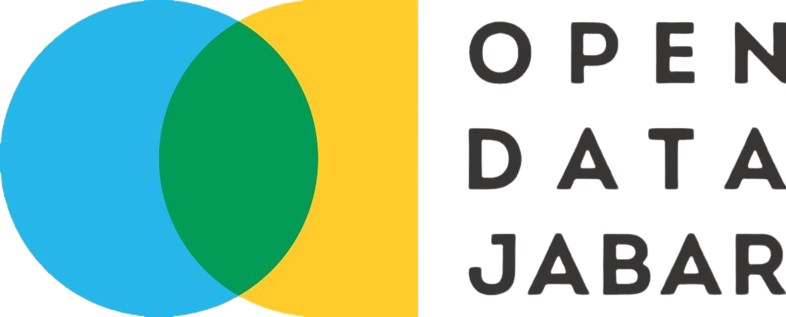

  
   

# 📖 **Pendahuluan**

---

Proyek ini bertujuan untuk menganalisis tingkat kemiskinan di Indonesia periode 2019–2024 menggunakan metode K-Means. Analisis ini dilakukan untuk mengelompokkan provinsi berdasarkan kesamaan tingkat kemiskinan, sehingga dapat menggambarkan pola dan perbedaan kondisi sosial ekonomi antar wilayah.

## 💡Latar Belakang (Yasinta)

## 🎯Tujuan Penelitian (Yasinta)

## 📊Data dan Variabel (Avin)

   
  Open Data Jabar

## ⚙️Metodologi (Joi)
Proyek ini menggunakan dua pendekatan utama:
1. Statistik Deskriptif : memberikan gambaran umum mengenai sebaran dan karakteristik data kendaraan bermotor.
2. Klastering K-Means : mengelompokkan daerah berdasarkan kesamaan karakteristik penggunaan kendaraan bermotor.

## 💎Manfaat Penelitian (Yasinta)

## 👥Tim Penyusun
* Joice Junansi Tandirerung (M0501251007)
* Avin Rahmadian (M0501251023)
* Charisma Yasintasya Kafilla (M0501251039)
* Francisca Juventini Mandas (M0501251045)
* Baiq Wita Rachmatia (M0501251061)
